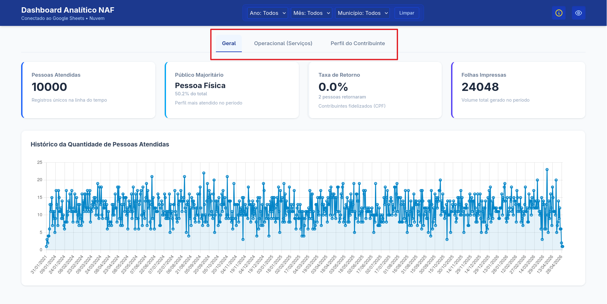
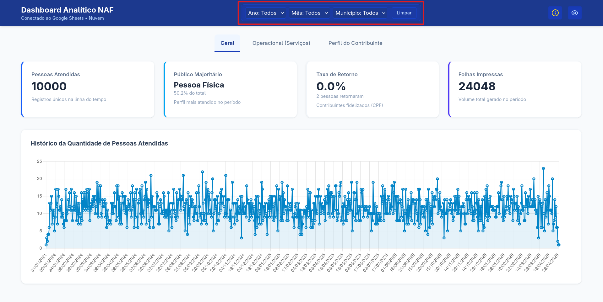
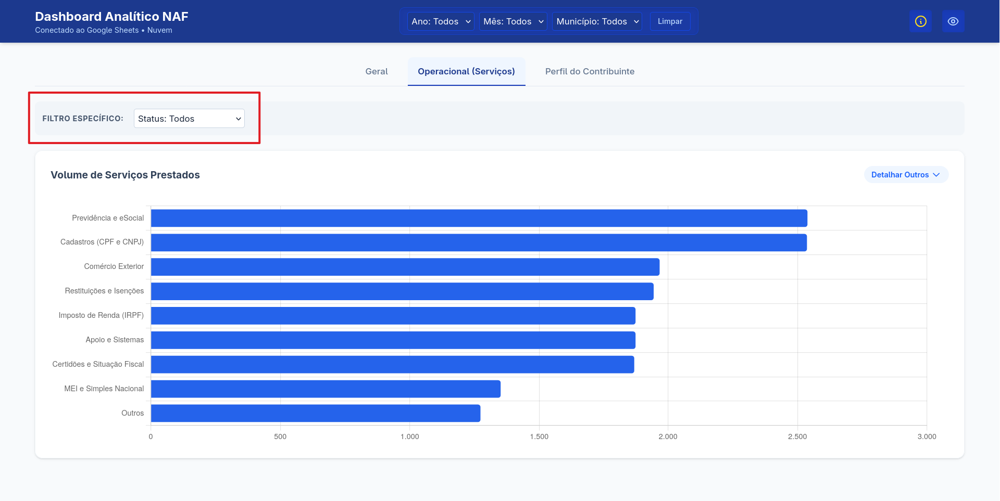
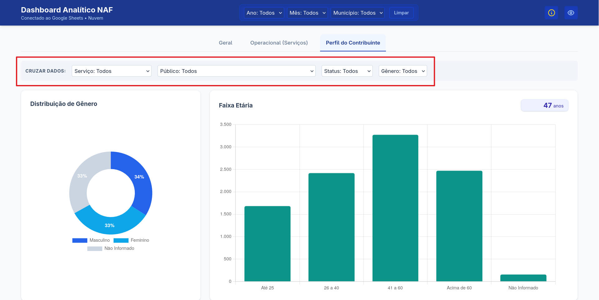
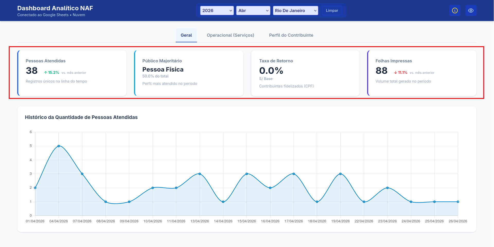
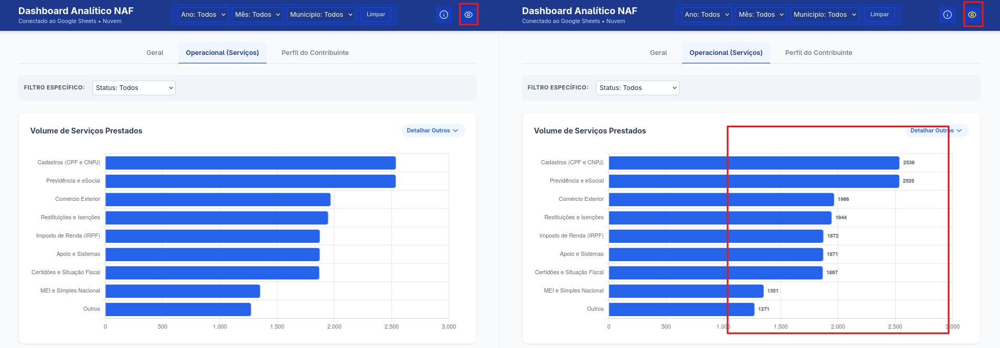
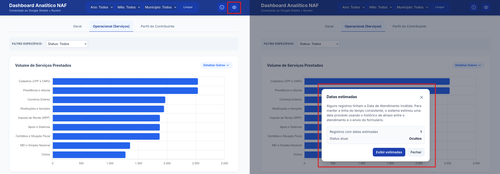
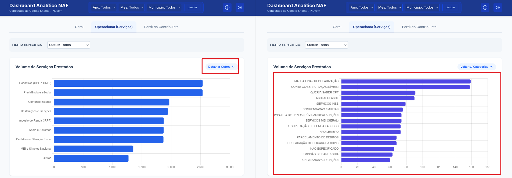
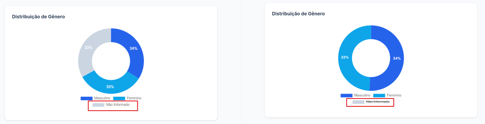

# 📖 Guia de Uso: Dashboard Analítico NAF

Este guia instrui coordenadores e alunos sobre como navegar, filtrar e interpretar os dados do **Dashboard NAF**. O painel é atualizado em tempo real conforme as planilhas de atendimento são preenchidas.

## 1. Estrutura do Painel

O Dashboard é dividido em três áreas principais de análise, acessíveis pelas abas no topo da página:

* **Geral:** Visão macro do volume de atendimentos e produtividade.
* **Operacional (Serviços):** Detalhamento de quais tipos de serviços estão sendo mais demandados.
* **Perfil do Contribuinte:** Análise demográfica (quem é o público que o NAF atende).

## 2. Como Filtrar os Dados

O sistema possui dois níveis de filtros:

### A. Filtros Globais (Cabeçalho)

Localizados no topo azul, estes filtros afetam **todos os gráficos e números** de todas as abas simultaneamente.

* **Ano:** Selecione um ano específico para análise.
* **Mês:** Filtre por um mês específico ou veja o acumulado do ano ("Todos").
* **Município:** Filtre atendimentos de uma cidade específica.
* **Botão Limpar:** Reseta **todos** os filtros da página para o estado inicial — inclusive os filtros locais das abas Operacional e Perfil, não só os globais deste cabeçalho.

### B. Filtros Locais (Dentro das Abas)

Existem filtros cinzas dentro das abas "Operacional" e "Perfil". Eles servem para fazer **cruzamentos de dados específicos** (Ex: "Ver o perfil de gênero apenas de quem buscou o serviço de IRPF").

**Aba Operacional**

**Aba Perfil**

## 3. Entendendo os Indicadores (KPIs)

Na aba **Geral**, você encontrará quatro cartões principais:

* **Pessoas Atendidas:** Volume total de registros únicos na linha do tempo.
* **Público Majoritário:** O perfil de usuário que mais buscou os serviços.
* **Taxa de Retorno:** A porcentagem de contribuintes (identificados por hashes únicos e pseudonimizados do CPF) que voltaram ao NAF em dias diferentes (fidelização).
* **Folhas Impressas:** Total de impressões geradas para o contribuinte.

**📊 A lógica das setas:**

* 🟢 **Verde (↑):** O volume aumentou em relação ao mês anterior (ou ano anterior).
* 🔴 **Vermelho (↓):** O volume diminuiu em relação ao período passado.
* ⚪ **Cinza:** Não há dados suficientes no passado para comparação.

## 4. Recursos Interativos

O Dashboard não é apenas visual; você pode interagir com os elementos:

### Botão "Valores"

No canto superior direito, há um botão com ícone de **olho**. Ele controla a exibição dos valores numéricos nos gráficos.

* Quando o botão está **azul**, os valores ficam ocultos.
* Quando o botão está **amarelo**, os valores aparecem nos gráficos.

Esse botão funciona como um interruptor visual: ao clicar, os valores são exibidos ou ocultados diretamente nos gráficos.

### Botão "Datas estimadas"

Quando o Dashboard identifica registros com datas estimadas, aparece no canto superior direito um botão com ícone de **informação**.

Esse botão abre uma janela explicativa sobre as datas estimadas. Nessa janela, o usuário pode verificar:

* o que são datas estimadas;
* quantos registros foram estimados;
* se esses registros estão incluídos ou ocultos nos indicadores;
* a opção para ocultar ou exibir esses registros no Dashboard.

A cor do botão indica o estado atual:

* Quando o botão está **amarelo**, as datas estimadas estão incluídas no Dashboard.
* Quando o botão está **azul**, as datas estimadas estão ocultas.

Esse recurso ajuda a comparar os resultados com e sem registros estimados.

### Detalhar "Outros" (Drill-down)

Na aba **Operacional**, o gráfico agrupa serviços pouco frequentes na categoria "Outros".

1. Clique no botão **"Detalhar Outros"**.
2. O gráfico irá se transformar, mostrando o "Top 20" termos digitados manualmente pelos alunos no formulário.
3. Clique em **"Voltar"** para retornar às categorias principais.

### Legendas de Gráficos

Nos gráficos de pizza, você pode clicar nos itens da **Legenda** para desativar temporariamente aquela cor, permitindo focar apenas nos dados que restaram.

## 5. Dicas de Interpretação

1. **Gráfico de Evolução:** Se houver um pico em um dia específico, verifique se houve algum evento ou mutirão do NAF naquela data.
2. **Média de Idade:** Localizada na aba **Perfil**, ela ajuda a entender se o público do seu núcleo é majoritariamente jovem (estudantes/empreendedores) ou idosos (aposentados/isento).
3. **Alcance Geográfico:** Use este gráfico para descobrir de quais cidades os contribuintes estão vindo. Se uma cidade vizinha tem muitos acessos, pode ser interessante focar na divulgação naquela região.

## 6. Resolução de Problemas Comuns

* **"O gráfico aparece escrito 'Sem dados'":** Isso significa que a combinação de filtros que você selecionou (Ex: Ano 2026 + Mês Janeiro + Cidade X) não possui nenhum atendimento registrado na planilha.
* **"Os números parecem errados":** Verifique se o filtro de **Município** ou **Mês** não ficou selecionado acidentalmente no topo da página.
* **"A página está em branco":** Tente atualizar (F5). Se o problema persistir, a planilha de dados pode ter sido movida ou renomeada.
* **"Apareceu o botão de Datas estimadas":** Isso significa que alguns registros tinham a Data de Atendimento inválida e o sistema estimou uma data provável para eles. Você pode clicar no botão para incluir ou remover esses registros dos gráficos e indicadores.
* **"Os números mudaram quando cliquei em Datas estimadas":** Isso é esperado. Quando as datas estimadas são ocultadas, o Dashboard recalcula os KPIs e gráficos sem esses registros.
